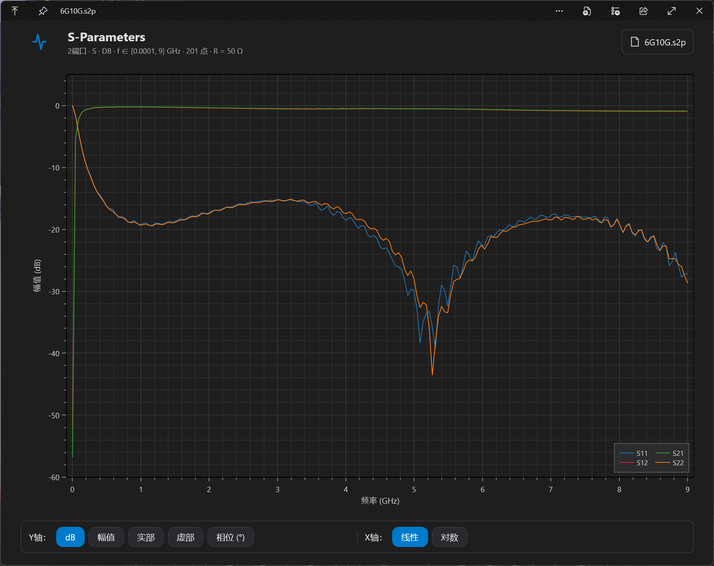

# QuickLook.Plugin.SnpViewer

A [QuickLook](https://github.com/QL-Win/QuickLook) plugin that lets you press
**Space** in File Explorer to instantly preview Touchstone S-parameter files
(`.s1p`, `.s2p`, ..., `.snp`, `.ts`) as OxyPlot charts of the frequency
response.



## Features

- Parses **Touchstone v1.1 and v2.x** files (RI / MA / dB formats, S/Y/Z/G/H
  parameter types, Hz / kHz / MHz / GHz units, per-port reference resistance).
- Handles `[Noise]` blocks (basic nf_db + Rn columns).
- Renders every `Sij` (or `Yij` / `Zij` / ...) parameter on a single chart with
  switchable Y-axis (dB, Magnitude, Real, Imaginary, Phase) and X-axis (Linear
  / Log).
- Shows a tabular preview of the first 1000 data points in real/imag,
  magnitude/angle, and dB representations.
- Sniffs non-Touchstone files early so the plugin does not steal the preview
  from other viewers.
- Provides More-menu entries to open the file in the system's default text
  editor or reveal it in File Explorer.

## Supported extensions

```
.s1p .s2p .s3p .s4p .s5p .s6p .s7p .s8p .snp .ts
```

## Prerequisites

- **Windows** with the **.NET Framework 4.6.2** development pack installed
  (ships with Visual Studio 2017/2019/2022 "Desktop development with C++"
  workload, or can be added separately as
  *Microsoft.NETFramework.ReferenceAssemblies.net462*).
- One of:
  - **MSBuild** (bundled with Visual Studio or Build Tools for Visual Studio)
  - **.NET SDK 6.0 or newer** with `dotnet` on `PATH`

> OxyPlot and QuickLook.Common are pulled in automatically as NuGet
> dependencies — there is nothing else to install.

## Building

```cmd
:: Clone (no submodules needed any more)
git clone https://github.com/your-name/QuickLook.Plugin.SnpViewer.git
cd QuickLook.Plugin.SnpViewer

:: Build (either of the following works)
build.cmd                                :: MSBuild / dotnet, Release|AnyCPU
dotnet build QuickLook.Plugin.SnpViewer.sln -c Release
```

The build output is written to
`Build\Release\QuickLook.Plugin\QuickLook.Plugin.SnpViewer\`.

## Packaging as a `.qlplugin`

A `.qlplugin` file is a ZIP containing the build output. Use the PowerShell
helper:

```powershell
package.ps1 -Configuration Release -Platform AnyCPU
```

This produces `QuickLook.Plugin.SnpViewer.qlplugin`. Manually it is just:

```powershell
Compress-Archive -Path .\Build\Release\QuickLook.Plugin\QuickLook.Plugin.SnpViewer\* `
                 -DestinationPath .\QuickLook.Plugin.SnpViewer.qlplugin `
                 -Force
```

The resulting archive contains the plugin DLL, `OxyPlot.Wpf.dll`,
`OxyPlot.dll` and `Translations.config`. `QuickLook.Common.dll` is **not**
included because it is provided by the host QuickLook process.

## Installing

1. Quit QuickLook.
2. Copy the contents of the `.qlplugin` package into
   `%LocalAppData%\QuickLook\QuickLook.Plugin.SnpViewer\`.
3. Start QuickLook.
4. Select a `.s2p` file (or any other Touchstone file) in File Explorer and
   press **Space**.

## Testing

```cmd
dotnet test tests\QuickLook.Plugin.SnpViewer.Tests.csproj
```

The test project parses the sample files in `samples/` and asserts the
expected numerical values.

## Project layout

```
.
├── QuickLook.Plugin.SnpViewer/
│   ├── Plugin.cs                         # IViewer implementation
│   ├── Plugin.MoreMenu.cs                # IMoreMenu implementation
│   ├── SnpPanel.xaml(.cs)                # WPF panel + OxyPlot + DataGrid
│   ├── TouchstoneParser.cs               # Touchstone v1/v2 text parser
│   ├── TouchstoneDocument.cs             # Data model
│   ├── Translations.config
│   ├── Properties/AssemblyInfo.cs
│   ├── Properties/GitVersion.cs
│   └── QuickLook.Plugin.SnpViewer.csproj
├── samples/                              # Test fixtures (.s1p / .s2p)
├── tests/                                # xUnit tests
├── .gitignore
├── QuickLook.Plugin.SnpViewer.sln
├── build.cmd / build.sh                  # Convenience build wrappers
├── package.ps1                           # Builds the .qlplugin
└── LICENSE-GPL.txt
```

## License

GPL-3.0-or-later. See `LICENSE-GPL.txt`.

## Acknowledgements

- [QuickLook](https://github.com/QL-Win/QuickLook) by the QL-Win contributors.
- [OxyPlot](https://github.com/oxyplot/oxyplot) for the WPF charting engine.
- [Touchstone File Format Specification v2.1](https://ibis.org/touchstone_ver2.1/)
  (IBIS Open Forum).
